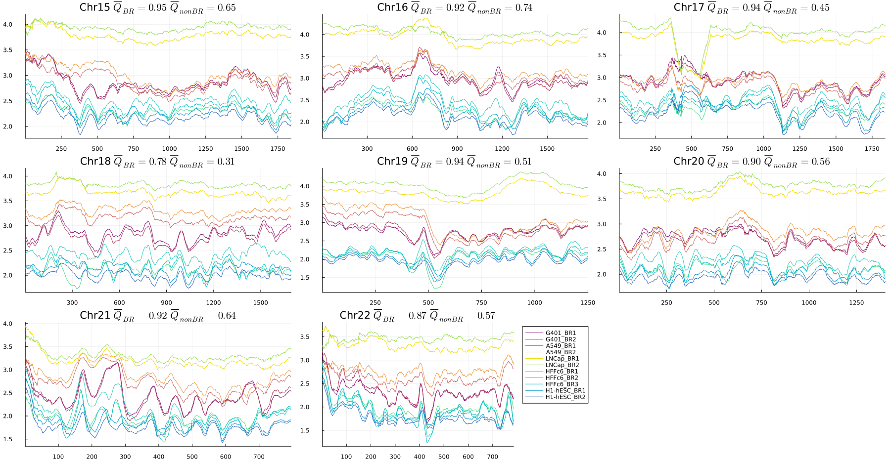
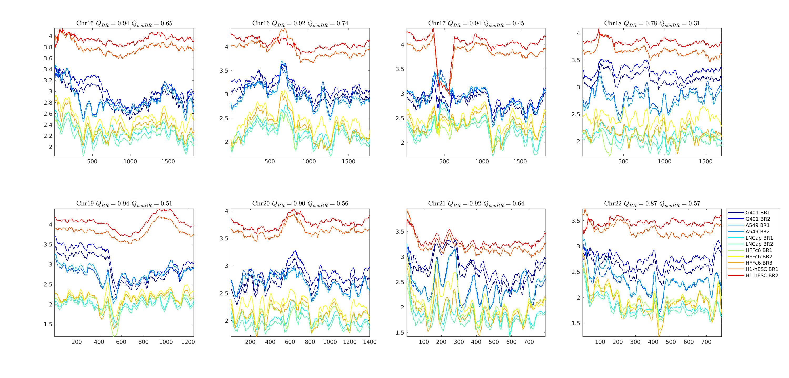

<figure>
    
</figure>

# 

ENT3C is a method for qunatifying the similarity of micro-C/Hi-C derived chromosomal contact matrices. It is based on the von Neumann entropy<sup>1</sup> and recent work on entropy quantification of Pearson correlation matrices<sup>2</sup>.
For a contact matrix, ENT3C records the change in local pattern *complexity* of smaller Pearson-transformed submatrices along a matrix diagonal to generate a characteristic signal. Similarity is defined as the Pearson correlation between the respective entropy signals of two contact matrices.

https://doi.org/10.1093/nargab/lqae076

## Summary of ENT3C approach
1. Loads cooler files and looks for shared empty bins.
2. ENT3C will first take the logarithm of an input matrix $\mathbf{M}$
2. Next, smaller submatrices $\mathbf{a}$ of dimension $n\times n$ are extracted along the diagonal of an input contact matrix $\mathbf{M}$
4. $nan$ values in $\mathbf{a}$ are set to the minimum value in $\mathbf{a}$.
5. $\mathbf{a}$ is transformed into a Pearson correlation matrix $\mathbf{P}$.
6. $\mathbf{P}$ is transformed into $\boldsymbol{\rho}=\mathbf{P}/n$ to fulfill the conditions for computing the von Neumann entropy.
7. The von Neumann entropy of $\boldsymbol{\rho}$ is computed as

   $S(\boldsymbol{\rho})=\sum_j \lambda_j \log \lambda_j$

   where $\lambda_j$ is the $j$ th eigenvalue of $\boldsymbol{\rho}$
8. This is repeated for subsequent submatrices along the diagonal of the input matrix and stored in the *entropy signal* $\mathbf{S}\_{M}$.
9. Similarity $Q$ is defined as the Pearson correlation $r$ between the entropy signals of two matrices: $Q(\mathbf{M}\_1,\mathbf{M}\_2) = r(\mathbf{S}\_{\mathbf{M}\_1},\mathbf{S}\_{\mathbf{M}\_2})$.

<figure>
    
</figure>

Exemplary epiction of ENT3C derivation of the entropy signal $\mathbf{S}$ of two contact matrices $\mathbf{M}\_1$ and $\mathbf{M}\_2$. ENT3C's was run with  submatrix dimension $n=300$, window shift $\varphi=10$, and maximum number of data points in $\boldsymbol{S}$, $\Phi\_{\max}=\infty$, resulting in $\Phi=147$ submatrices. For subsequent scaled Pearson-transformed submatrices, $\boldsymbol{\rho}\_i$, along the diagonal of $\log{\boldsymbol{M}}$, ENT3C computes the von Neumann entropies $S(\boldsymbol{\rho}\_1), S(\boldsymbol{\rho}\_2), \ldots, S(\boldsymbol{\rho}\_{PHI})$. The resulting signal $\mathbf{S} = \langle S(\boldsymbol{\rho}\_{1}), S(\boldsymbol{\rho}\_{2}), \ldots, S(\boldsymbol{\rho}\_{\Phi}) \rangle$ is shown in blue under the matrix. The first two ($\boldsymbol{\rho}\_{1-2}$), middle ($\boldsymbol{\rho}\_{73}$), and last two submatrices ($\boldsymbol{\rho}\_{146-147}$) are shown.


# Requirements
Julia or MATLAB

# Data

Both Julia and MATLAB implementations (```ENT3C.jl``` and ```ENT3C.m```) were tested on Hi-C and micro-C contact matrices binned at 40 kb in ```cool``` format. 

**micro-C** 
| Cell line | Biological Replicate (BR) | Accession (Experiemnt set) | Accession (```pairs```) |
| --- | --- | --- | --- |
| H1-hESC | 1 | 4DNES21D8SP8 | 4DNFING6ZFD, 4DNFIBMG8YA3, 4DNFIMT4PHZ1, 4DNFI8GM4EL9 |
| H1-hESC | 2 | 4DNES21D8SP8 | 4DNFIIYUGYBU, 4DNFI89L17XY, 4DNFIXP9MVBU, 4DNFI2YHYAJO, 4DNFIULY29IQ |
| HFFc6   | 1 | 4DNESphiT3UBH | 4DNFIN7IIIY6, 4DNFIJZDEIZ3, 4DNFIYBTHGNA, 4DNFIK8UIB5B |
| HFFc6   | 2 | 4DNESphiT3UBH | 4DNFIF5F4HRG, 4DNFIK82YRNM, 4DNFIATCW955, 4DNFIZU6ADT1, 4DNFIKWV6BY2  |
| HFFc6   | 3 | 4DNESphiT3UBH | 4DNFIFJL4JIH, 4DNFIONHB78N, 4DNFIG1ZOVIM, 4DNFIPKVL9YI, 4DNFIJM966UR, 4DNFIV8JNJB8 |

**Hi-C** 
| Cell line | Biological Replicate (BR) | Accession (Experiemnt set)  | Accession (```BAM```) |
| --- | --- | --- | --- |
| G401  | 1 | ENCSR079VIJ | ENCFF649MAY |
| G401  | 2 | ENCSR079VIJ | ENCFF758WUD |
| LNCaP | 1 | ENCSR346DCU | ENCFF977XHB |
| LNCaP | 2 | ENCSR346DCU | ENCFF204XII |
| A549  | 1 | ENCSR444WCZ | ENCFF867DCM |
| A549  | 2 | ENCSR444WCZ | ENCFF532XBC |

 1. for the Hi-C data, ```bam``` files were downloaded from the ENCODE data portal and converted into ```pairs``` files using the ```pairtools parse``` function<sup>3</sup>

	```pairtools parse --chroms-path hg38.fa.sizes -o <OUT.pairs.gz> --assembly hg38 --no-flip  --add-columns mapq  --drop-sam --drop-seq  --nproc-in 15 --nproc-out 15 <IN.bam>```

2. for the micro-C data, ```pairs``` of technical replicates (TRs) were merged with ```pairtools merge```. E.g. for H1-hESC, BR1 (4DNES21D8SP8):

	```pairtools merge -o <hESC.BR1.pairs.gz> --nproc 10 4DNFING6ZFDF.pairs.gz 4DNFIBMG8YA3.pairs.gz 4DNFIMT4PHZ1.pairs.gz 4DNFI8GM4EL9.pairs.gz```

3. 40 kb coolers were generated from the Hi-C/micro-C pairs files with ```cload pairs``` function<sup>4</sup>
 
	```cooler cload pairs -c1 2 -p1 3 -c2 4 -p2 5 --assembly hg38 <CHRSIZE_FILE:40000> <IN.pairs.gz> <OUT.cool>```

# Configuration File
Both Julia and MATLAB implementations (```ENT3C.jl``` and ```ENT3C.m```) call a configuration file in JSON format. 

:bulb: The main ENT3C parameter affecting the final entropy signal $S$ is the dimension of the submatrices ```SUB_M_SIZE_FIX```. 

```SUB_M_SIZE_FIX``` can be either be fixed by or alternatively, one can specify ```CHRSPLIT```; in this case ```SUB_M_SIZE_FIX``` will be computed internally to fit the number of desired times the contact matrix is to be paritioned into. 

```PHI=1+floor((N-SUB_M_SIZE)./phi)```

where ```N``` is the size of the input contact matrix, ```phi``` is the window shift, ```PHI``` is the number of evaluated submatrices (consequently the number of data points in $S$).

<br>

**ENT3C parameters set in ```config/config.json```**

```"DATA_PATH": "DATA"``` $\dots$ input data path. 

```
"FILES": [
	"ENCSR079VIJ.BioRep1.40kb.cool",
 
	"G401_BR1",
 
	"ENCSR079VIJ.BioRep2.40kb.cool",
 
	"G401_BR2"]
```
 
$\dots$ input files in format: ```[<COOL_FILENAME>, <SHORT_NAME>]```

:bulb: ENT3C also takes ```mcool``` files as input. Please refer to biological replicates as "_BR%d" in the <SHORT_NAME>.

```"`OUT_DIR": "OUTPUT/"``` $\dots$ output directory. ```OUT_DIR``` will be concatenated with ```OUTPUT/JULIA/``` or ```OUTPUT/MATLAB/```.

```"OUT_PREFIX": "40kb"``` $\dots$ prefix for output files.

```"Resolution": "40e3,100e3"``` $\dots$ resolutions to be evaluated. 

```"ChrNr": "15:22"``` $\dots$ chromosome numbers to be evaluated. Set individual chromosomes as ```ChrNr: "15,17,22"```. 

```"NormM": 0``` $\dots$ input contact matrices can be balanced. If ```NormM: 1```, balancing weights in cooler are applied.

```"SUB_M_SIZE_FIX": null``` $\dots$ fixed submatrix dimension.

```"CHRSPLIT": 10``` $\dots$ number of submatrices into which the contact matrix is partitioned into.

```"phi": 1``` $\dots$ number of bins to the next matrix.

```"PHI_MAX": 1000``` $\dots$ number of submatrices; i.e. number of data points in entropy signal $S$. 
If set, $\varphi$ is increased until $\Phi \approx \Phi\_{\max}$.

# Running main scripts 

Upon modifying ```config/config.json``` as desired, ```ENT3C.jl``` and ```ENT3C.m``` will run with using specified parameters.

Associated functions are contained in directories ```JULIA_functions/``` and ```MATLAB_functions/```.

**Output files:**
```40kb_ENT3C_similarity.csv``` $\dots$ will contain all combinations of comparisons. The second two columns contain the short names specified in ```FILES``` and the third column ```Q``` the corresponding similarity score.  
```
Resolution	ChrNr	Sample1	Sample2	Q
40000	15	A549_BR1	A549_BR2	0.995462832813044
40000	15	A549_BR1	G401_BR1	0.565465091507697
40000	15	A549_BR1	G401_BR2	0.587395560010108
40000	15	A549_BR1	H1-hESC_BR1	0.511892949109715
40000	15	A549_BR1	H1-hESC_BR2	0.46675009291503
.		.	.		.	.	.		.		.		.		.
.		.	.		.	.	.		.		.		.		.
.		.	.		.	.	.		.		.		.		.
```

```40kb_ENT3C_OUT.csv``` $\dots$ ENT3C output table. 
```
Name	ChrNr	Resolution	n	PHI	phi	binNrStart	binNrEND	START	END	S
G401_BR1	15	40000	292	877	2	1	369	0	14760000	3.70691992953067
G401_BR1	15	40000	292	877	2	3	371	80000	14840000	3.68605952020314
G401_BR1	15	40000	292	877	2	12	373	440000	14920000	3.67630110653009
.		.	.		.	.	.		.		.		.		.
.		.	.		.	.	.		.		.		.		.
.		.	.		.	.	.		.		.		.		.
```
Each row corresponds to an evaluated submatrix with fields ```Name``` (the short name specified in ```FILES```), ```ChrNr```, ```Resolution```, the sub-matrix dimension ```sub_m_dim```, ```PHI=1+floor((N-SUB_M_SIZE)./phi)```, ```binNrStart``` and ```binNrEnd``` correspond to the start and end bin of the submatrix, ```START``` and ```END``` are the corresponding genomic coordinates and ```S``` is the computed von Neumann entropy.

```40kb_ENT3C_signals.png``` $\dots$ simple visualization of entropy signals $S$:


Entropy signals $S$ generated by the Julia script ```ENT3C.jl``` for contact matrices of chromosome 15-22 binned at 40 kb in various cell lines:
<figure>
    
</figure>

Entropy signals $S$ generated by the MATLAB script ```ENT3C.m``` for contact matrices of chromosomes 15-22 binned at 40 kb in various cell lines.
<figure>
    
</figure>


# References
1. Neumann, J. von., Thermodynamik quantenmechanischer Gesamtheiten. Nachrichten von der Gesellschaft der Wissenschaften zu Göttingen. Mathematisch-Physikalische Klasse 1927. 1927. 273-291.
2. Felippe, H., et. al., Threshold-free estimation of entropy from a pearson matrix. EPL. 141(3):31003. 2023.
3. Open2C et. al., Pairtools: from sequencing data to chromosome contacts. bioRxiv. 2023. 
4. Abdennur,N., and Mirny, L.A., Cooler: scalable storage for Hi-C data and other genomically labeled arrays. Bioinformatics. 2020.
