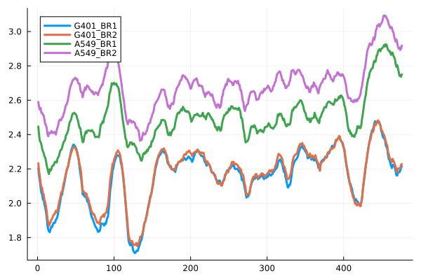

# ENT3C
ENT3C is a method for qunatifying the similarity of 3C-Seq derived chromosomal contact matrices by comparing the "complexity" of patterns contained in smaller submatrices along their diagonals. It is based on the von Neumann entropy<sup>1</sup> and recent work for entropy quantification of Pearson correlation matrices<sup>2</sup>.

https://doi.org/10.1101/2024.01.30.577923 

Newest implementation in Julia (```example.jl```, ```ent3c_functions.jl```)

*note*: matlab function and example script will be updated soon. 


**summary of workflow**
1. loads cooler files into MATLAB and looks for shared empty bins
2. ENT3C will extract smaller submatrices $\hat{a}$ of dimension $n\times n$ along the diagonal of an input contact matrix 
4. the logarithm of $\hat{a}$ is taken ($nan$s are set to zero)
5. $\hat{a}$ is transformed into a Pearson correlation matrix $\hat{P}$ ($nan$ values are set to zero)
6. $\hat{P}$ is transformed into $\hat{\rho}=\hat{P}/n$ to fulfill the conditions for computing the von Neumann entropy
7. the von Neumann entropy of $\hat{\rho}$ is computed as

   $S(\boldsymbol{\rho})=\sum_j \lambda_j \log \lambda_j$

   where $\lambda_j$ is the $j$ th eigenvalue of $\hat{\rho}$
8. this is repeated for subsequent submatrices along the diagonal of the input matrix and stored in the **"entorpy signal"** $S$
9. the Pearson correlation between $S$ of two matrices, is used as a similarity metric 

)

## Requirements

Contact matrices in cool format (https://github.com/open2c/cooler)<sup>3</sup>

! example.m works on 40 kb binned cool files !
! example.jl works on any cool/mcool file !

# Data
example.jl was tested on Hi-C contact matrices of two biological replicates of the G401 (ENCSR079VIJ) and A549 (ENCSR444WCZ) cell-lines (hg38)

example.m was tested on micro-C contact matrices of two biological replicates of the hESC (4DNFI9GMP2J8) cell-line and on Hi-C contact matrices of two biological replicates of the G401 (ENCSR079VIJ) (hg38)

 - download contact list-replicate (pairs) files for technical replicates corresponding to biological replicate
 - aggregate pairs using pairtools merge (https://github.com/open2c/pairtools)<sup>4</sup>
 - generate 40kb cool files using cooler cload pairs
   
## example.jl
put file names to analyze here
```
FNs = [INFO("DATA_30e6/ENCSR079VIJ.BioRep1.mcool","G401_BR1"),
       INFO("DATA_30e6/ENCSR079VIJ.BioRep2.mcool","G401_BR2"),
       INFO("DATA_30e6/ENCSR444WCZ.BioRep1.mcool","A549_BR1"),
       INFO("DATA_30e6/ENCSR444WCZ.BioRep2.mcool","A549_BR2")] 
```
default parameters at end
```
Resolution:Int=40e3
ChrNr::Int=14
SUB_M_SIZE_FIX::Int=0
CHRSPLIT::Int=7
WN_MAX::Int=1e3
WS::Int=1

ENT3C_OUT, Similarity, p = ENT3C(FNs,Resolution,ChrNr,SUB_M_SIZE_FIX,CHRSPLIT,WN_MAX,WS)
```
```
cat ENT3C_similarity.csv
Sample1,Sample2,Q
G401_BR1,G401_BR2,0.9761518917035111
G401_BR1,A549_BR1,0.5577613608825013
G401_BR1,A549_BR2,0.6166927743995316
G401_BR2,A549_BR1,0.4117476379916582
G401_BR2,A549_BR2,0.4878112361590029
A549_BR1,A549_BR2,0.9754631389486167
```

## References
1. Neumann, J. von., Thermodynamik quantenmechanischer Gesamtheiten. Nachrichten von der Gesellschaft der Wissenschaften zu Göttingen, Mathematisch-Physikalische Klasse 1927, 1927, 273-291.
2. Felippe, H., et. al., Threshold-free estimation of entropy from a pearson matrix. EPL, 141(3):31003, 2023.
3. Abdennur,N., and Mirny, L.A., Cooler: scalable storage for Hi-C data and other genomically labeled arrays, Bioinformatics, 2020.
4. Open2C*, et. al., Pairtools: from sequencing data to chromosome contacts. bioRxiv, 2023.
