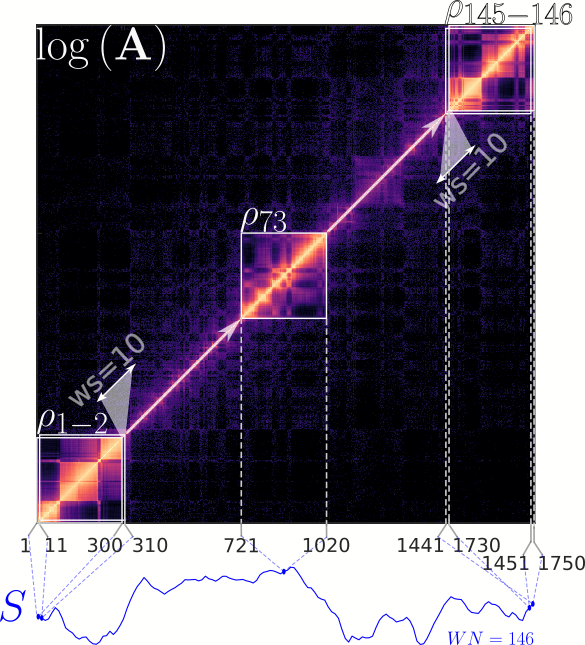

# ENT3C :duck:
ENT3C is a method for qunatifying the similarity of 3C-Seq derived chromosomal contact matrices by comparing the "complexity" of patterns contained in smaller submatrices along their diagonals. It is based on the von Neumann entropy<sup>1</sup> and recent work on entropy quantification of Pearson correlation matrices<sup>2</sup>.

https://doi.org/10.1101/2024.01.30.577923 

## Summary of ENT3C approach
1. loads cooler files into MATLAB and looks for shared empty bins
2. ENT3C will extract smaller submatrices $\mathbf{a}$ of dimension $n\times n$ along the diagonal of an input contact matrix 
4. the logarithm of $\mathbf{a}$ is taken ($nan$ values are set to zero)
5. $\mathbf{a}$ is transformed into a Pearson correlation matrix $\mathbf{P}$ ($nan$ values are set to zero)
6. $\mathbf{P}$ is transformed into $\boldsymbol{\rho}=\mathbf{P}/n$ to fulfill the conditions for computing the von Neumann entropy
7. the von Neumann entropy of $\boldsymbol{\rho}$ is computed as

   $S(\boldsymbol{\rho})=\sum_j \lambda_j \log \lambda_j$

   where $\lambda_j$ is the $j$ th eigenvalue of $\boldsymbol{\rho}$
8. this is repeated for subsequent submatrices along the diagonal of the input matrix and stored in the **"entorpy signal"** $S$
9. the Pearson correlation between $S$ of two matrices, is used as a similarity metric 

<figure>
    
</figure>

Exemplary depiction of ENT3C derivation of the entropy signal $S$ of the contact matrix $\mathbf{A}$ of chromosome 14 binned at 40 kb of the HFFc6 cell line (biological replicate 1). ENT3C's parameters: submatrix dimension $n=300$, window shift $WS=10$, maximum number of data points in $S$, $WN_{MAX}=\infty$, were used, resulting in 146 submatrices along the diagonal of the contact matrix. For subsequent Pearson-transformed submatrices $\mathbf{P}$ along the diagonal of $\log{\mathbf{A}}$, ENT3C computes the von Neumann entropies $S_i(\mathbf{P_i})$; the resulting signal $S$ is shown in blue under the matrix. The first two ($\mathbf{P_{1-2}}$), the middle ($\mathbf{P_{73}}$), and the last two Pearson submatrices ($\mathbf{P_{145-146}}$) are shown.

# Requirements
Julia or MATLAB

# Data
Both Julia and MATLAB implementations (```ENT3C.jl``` and ```ENT3C.m```) were tested on Hi-C contact matrices in ```mcool```/```cool``` format of two biological replicates of the G401 (ENCSR079VIJ) and A549 (ENCSR444WCZ) cell-lines (hg38):

 1. pairs files downloaded from ENCODE.
  
	G401 (ENCFF091BKE) A549 (ENCFF101MYU)

 4. generate 5kb coolers with ```cload pairs```<sup>3</sup> function
 
	```cooler cload pairs -c1 2 -p1 3 -c2 4 -p2 5 --assembly hg38 <CHRSIZE_FILE:5000> <IN_PAIRS> <OUT_COOL>```

 5. generate multi-resolution mcool files by coarsening <OUT_COOL>  with ```cload zoomify```<sup>3</sup>
    
	```cooler zoomify --resolutions 5000,10000,25000,40000,50000,100000,250000,500000,1000000,2500000,5000000,10000000 --balance --balance-args '--max-iters 300' -o <OUT_MCOOL> <OUT_COOL>```

# Configuration File
Both Julia and MATLAB implementations (```ENT3C.jl``` and ```ENT3C.m```) call a configuration file in JSON format. 

:bulb: The main ENT3C parameter affecting the final entropy signal $S$ is the dimension of the submatrices ```SUB_M_SIZE_FIX```. 

```SUB_M_SIZE_FIX``` can be either be fixed by or alternatively, one can specify ```CHRSPLIT```; in this case ```SUB_M_SIZE_FIX``` will be computed internally to fit the number of desired times the contact matrix is to be paritioned into. 

```WN=1+floor((N-SUB_M_SIZE)./WS)```

where ```N``` is the size of the input contact matrix, ```WS``` is the window shift, ```WN``` is the number of evaluated submatrices (consequently the number of data points in $S$).

<br>

**ENT3C parameters set in ```config/config.json```**

```DATA_PATH: "DATA_30e6"``` $\dots$ input data path. 

```FILES: ["ENCSR079VIJ.BioRep1.mcool","G401_BR1" ...]``` $\dots$ input files in format: ```[<MCOOL_FILENAME>, <SHORT_NAME>]```

```OUT_DIR: "OUTPUT/"``` $\dots$ output directory. :warning: ```OUT_DIR``` be concatenated with ```OUTPUT/JULIA/``` or ```OUTPUT/MATLAB/```.

```OUT_PREFIX: "Chr14_40kb"``` $\dots$ prefix for output files.

```Resolution: 40000``` $\dots$ resolution to be evaluated.

```ChrNr: 14``` $\dots$ chromosome number to be evaluated.

```NormM: 0``` $\dots$ input contact matrices can be balanced. If ```NormM:1```, balancing weights in cooler are applied.

```SUB_M_SIZE_FIX: null``` $\dots$ fixed submatrix dimension.

```CHRSPLIT: 7``` $\dots$ number of submatrices into which the contact matrix is partitioned into.

```WS: 1``` $\dots$ number of bins to the next matrix.

```WN_MAX: 1000``` $\dots$ number of submatrices; i.e. number of data points in entropy signal $S$. If set, $WS$ is increased until $WN \approx WN_{MAX}$.

# Running main scripts 

Upon modifying ```config/config.json``` as desired, ```ENT3C.jl``` and ```ENT3C.m``` will run with using specified parameters.

Associated functions are contained in directories ```JULIA_functions/``` and ```MATLAB_functions/```.

**Output files:**
```Chr14_40kb_ENT3C_similarity.csv``` $\dots$ will contain all combinations of comparisons. The first two columns contain the short names specified in ```FILES``` and the third column Q the corresponding similarity score.  
```
Sample1		Sample2		Q
A549_BR1	A549_BR2	0.975160965862958
A549_BR1	G401_BR1	0.557372221775637
A549_BR1	G401_BR2	0.41116314547437
A549_BR2	G401_BR1	0.616692774399531
A549_BR2	G401_BR2	0.487811236159002
G401_BR1	G401_BR2	0.97615189170351
```

```Chr14_40kb_ENT3C_OUT.csv``` $\dots$ ENT3C output table. 
```
Name		ChrNr	Resolution	WN	WS	binNrStart	binNrEND	START		END		S
G401_BR1	14	40000		759	2	404		743		16120000	29720000	3.30042231994416
G401_BR1	14	40000		759	2	483		745		19280000	29800000	3.29667980447196
G401_BR1	14	40000		759	2	494		747		19720000	29880000	3.30020988472917
.		.	.		.	.	.		.		.		.		.
.		.	.		.	.	.		.		.		.		.
.		.	.		.	.	.		.		.		.		.
```
Each row corresponds to an evaluated submatrix with fields ```Name``` (the short name specified in ```FILES```), ```ChrNr```, ```Resolution```, ```WN=1+floor((N-SUB_M_SIZE)./WS)```, ```binNrStart``` and ```binNrEnd``` correspond to the start and end bin of the submatrix, ```START``` and ```END``` are the corresponding genomic coordinates and ```S``` is the computed von Neumann entropy.

```Chr14_40kb_ENT3C_signals.png``` $\dots$ simple visualization of entropy signals $S$:
<figure>
    
</figure>

Entropy signals $S$ generated by ```ENT3C.jl``` for A549 and G401 contact matrices of chromosome 14 binned at 40 kb.

# References
1. Neumann, J. von., Thermodynamik quantenmechanischer Gesamtheiten. Nachrichten von der Gesellschaft der Wissenschaften zu Göttingen, Mathematisch-Physikalische Klasse 1927, 1927, 273-291.
2. Felippe, H., et. al., Threshold-free estimation of entropy from a pearson matrix. EPL, 141(3):31003, 2023.
3. Abdennur,N., and Mirny, L.A., Cooler: scalable storage for Hi-C data and other genomically labeled arrays, Bioinformatics, 2020.
