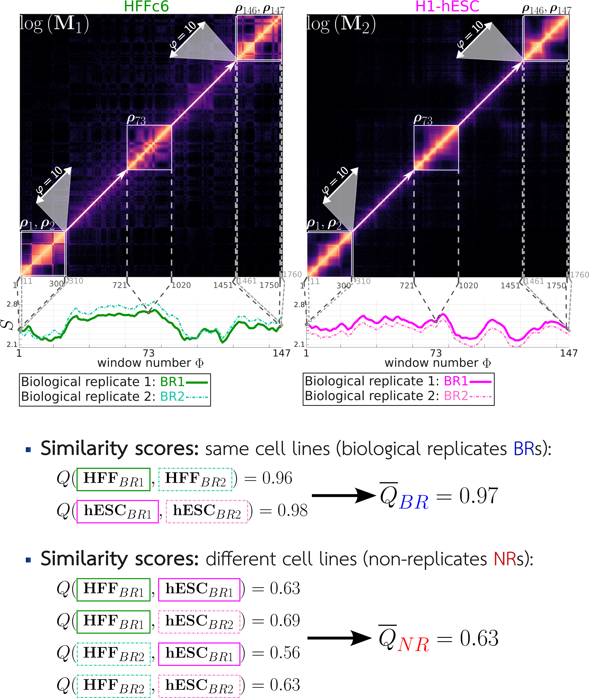

<figure>
    
</figure>

# 

ENT3C is a method for qunatifying the similarity of micro-C/Hi-C derived chromosomal contact matrices. It is based on the von Neumann entropy<sup>1</sup> and recent work on entropy quantification of Pearson correlation matrices<sup>2</sup>.
For a contact matrix, ENT3C records the change in local pattern *complexity* of smaller Pearson-transformed submatrices along a matrix diagonal to generate a characteristic signal. Similarity is defined as the Pearson correlation between the respective entropy signals of two contact matrices.

https://doi.org/10.1093/nargab/lqae076

## Summary of ENT3C approach
1. Loads cooler files and looks for shared empty bins.
2. ENT3C will first take the logarithm of an input matrix $\mathbf{M}$
2. Next, smaller submatrices $\mathbf{a}$ of dimension $n\times n$ are extracted along the diagonal of an input contact matrix $\mathbf{M}$
4. $nan$ values in $\mathbf{a}$ are set to the minimum value in $\mathbf{a}$.
5. $\mathbf{a}$ is transformed into a Pearson correlation matrix $\mathbf{P}$.
6. $\mathbf{P}$ is transformed into $\boldsymbol{\rho}=\mathbf{P}/n$ to fulfill the conditions for computing the von Neumann entropy.
7. The von Neumann entropy of $\boldsymbol{\rho}$ is computed as

   $S(\boldsymbol{\rho})=\sum_j \lambda_j \log \lambda_j$

   where $\lambda_j$ is the $j$ th eigenvalue of $\boldsymbol{\rho}$
8. This is repeated for subsequent submatrices along the diagonal of the input matrix and stored in the *entropy signal* $\mathbf{S}\_{M}$.
9. Similarity $Q$ is defined as the Pearson correlation $r$ between the entropy signals of two matrices: $Q(\mathbf{M}\_1,\mathbf{M}\_2) = r(\mathbf{S}\_{\mathbf{M}\_1},\mathbf{S}\_{\mathbf{M}\_2})$.

<figure>
    
</figure>

Exemplary epiction of ENT3C derivation of the entropy signal $\mathbf{S}$ of two contact matrices $\mathbf{M}\_1$ and $\mathbf{M}\_2$. ENT3C's was run with  submatrix dimension $n=300$, window shift $\varphi=10$, and maximum number of data points in $\boldsymbol{S}$, $\Phi\_{\max}=\infty$, resulting in $\Phi=147$ submatrices. For subsequent scaled Pearson-transformed submatrices, $\boldsymbol{\rho}\_i$, along the diagonal of $\log{\boldsymbol{M}}$, ENT3C computes the von Neumann entropies $S(\boldsymbol{\rho}\_1), S(\boldsymbol{\rho}\_2), \ldots, S(\boldsymbol{\rho}\_{\Phi})$. The resulting signal $\mathbf{S} = \langle S(\boldsymbol{\rho}\_{1}), S(\boldsymbol{\rho}\_{2}), \ldots, S(\boldsymbol{\rho}\_{\Phi}) \rangle$ is shown in blue under the matrix. The first two ($\boldsymbol{\rho}\_{1-2}$), middle ($\boldsymbol{\rho}\_{73}$), and last two submatrices ($\boldsymbol{\rho}\_{146-147}$) are shown.


# Installation

### Python (>=3.11) 
*  https://pypi.org/project/ENT3C/

1) generate and activate python environment 
	
	```
	python3.11 -m venv .ent3c_venv

	source .ent3c_venv/bin/activate
	```

2) install ENT3C:

	```
	pip install ENT3C
	```

### Linux executable

Pre-built Linux executable is available in the Releases section (v.2.2.0).

- Download and make file executable.
```
chmod +x ./path/to/exe/ENT3C_exe
```

- For global use add path to ```./bashrc``` file:
```
export PATH="$PATH:/path/to/exe/"
```

### Julia and Matlab versions

* &#128161; ***note*** that Python or executable is recommended.

* ```compare_groups``` is not currently available for MATLAB and Julia implementation.

* Matlab scripts in ```matlab_version_ENT3C``` directory.

* Julia scripts in ```julia_version_ENT3C```:
	* packages: DataFrames, BenchmarkTools, JSON, Printf, Plots, ColorSchemes, SuiteSparse, HDF5, NaNStatistics, Statistics, Combinatorics, CSV
	* For the Julia implementation, ubuntu's hdf5-tools is also required 
	* Initial julia set-up
		* option for automatic global installation ```--install-deps=yes```. (Works with any julia version)
		* predefined julia enviornments for julia versions 1.10.4 or 1.11.2 are defined in ```project_files/<v.v.v>/Manifest.toml``` and ```project_files/<v.v.v>/Project.toml```
		* option to load enviornments with ```--resolve-env=yes``` and ```--julia-version=<v.v.v>```

# Usage 

* CLI (python) usage:

	```
	Usage:
    	ENT3C <command> --config=<path/to/config.json> [options]

    	Commands:
            get_entropy        Generates entropy output file <entropy_out_FN> .
            get_similarity            Generates similarity output file <similarity_out_FN> from <entropy_out_FN>.
            run_all            Generates <entropy_out_FN> and <similarity_out_FN>.
            compare_groups     Compare signal groups (requires --group1 and --group2 options)

    	Global Options:
            --config=<path>    Path to config JSON file (required for all commands)

    	<compare_groups> Options:
        	--group1=<GROUP>        First group name, must correspond to what comes before _BR* in config file.
        	--group2=<GROUP>        Second group name, must correspond to what comes before _BR* in config file.

		Examples:
            ENT3C run_all --config=configs/myconfig.json
            ENT3C get_entropy --config=configs/myconfig.json
            ENT3C get_similarity --config=configs/myconfig.json
            ENT3C compare_groups --config=configs/myconfig.json --group1=H1-hESC --group2=K562
	```

* Careful to use linux executable call: ```ENT3C_exe <command> --config=<path/to/config.json> [options]```

* alternatively run ENT3C in python as:

	```
	import ENT3C

	ENT3C_OUT = ENT3C.run_get_entropy("config/myconfig.json")

	Similarity = ENT3C.run_get_similarity("config/myconfig.json")

	ENT3C_OUT, Similarity = ENT3C.run_all("config/myconfig.json")

	EUCLIDEAN = ENT3C.run_compare_groups("config/myconfig.json",group1,group2)

	```

* all ENT3C parameters are defined in .json files ```config/config.json```. Examples can be found in ```config``` directory.

* Paremeters defined in <config_file>: 

	1) The main ENT3C parameter affecting the final entropy signal $S$ is the dimension of the submatrices ```SUB_M_SIZE_FIX```. 

		* ```"SUB_M_SIZE_FIX": <integer>``` $\dots$ fixed submatrix dimension.

			* ```SUB_M_SIZE_FIX``` can be either be fixed by or alternatively, one can specify ```CHRSPLIT```; in this case ```SUB_M_SIZE_FIX``` will be computed internally to fit the number of desired times the contact matrix is to be paritioned into. 

			```PHI=1+floor((N-SUB_M_SIZE)./phi)```

			where ```N``` is the size of the input contact matrix, ```phi``` is the window shift, ```PHI``` is the number of evaluated submatrices (consequently the 	number of data points in $S$).

		* ```"CHRSPLIT": <integer>``` $\dots$ number of submatrices into which the contact matrix is partitioned into. If specified, then ``"SUB_M_SIZE_FIX": null`` otherwise ``"CHRSPLIT": null``. 

	2) ```"DATA_PATH": </path/to/data> ``` $\dots$ input data path. 

	3) input files in format: ```[<COOL_FILENAME>, <SHORT_NAME>]```
		``` 
		"FILES": [
			"ENCSR079VIJ.BioRep1.40kb.cool",
			"G401_BR1",
			"ENCSR079VIJ.BioRep2.40kb.cool",
			"G401_BR2"]
		``` 
		* Any biological replicates must be indicated in <SHORT_NAME> using the suffix "_BR%d".

		* **Note:** ENT3C also takes ```mcool``` files as input. 

	4) ```"`OUT_DIR": "<desired_output_directory_name>"``` $\dots$ output directory. ```OUT_DIR``` will be concatenated with ```OUTPUT/JULIA/``` or ```OUTPUT/MATLAB/```.

	5) ```"OUT_PREFIX": "<desired_output_prefix_>"``` $\dots$ prefix for output files.

	6) ```"Resolution": "<integer,integer,...>" e.g. "40e3,100e3"``` $\dots$ resolutions to be evaluated. 

	7) ```"ChrNr": "<integer,integer,...>" "15,16,17,18,19,20,21,22,X"``` $\dots$ chromosome numbers to be evaluated.

	8) ```"NormM": <0|1>``` $\dots$ input contact matrices can be balanced. If ```NormM: 1```, balancing weights in cooler are applied. If set to 1, ENT3C expects weights to be in dataset ```/resolutions/<resolution>/bins/<WEIGHTS_NAME>```.

	9) ```"WEIGHTS_NAME": "<name_of_weights>"``` $\dots$ name of dataset in cooler containing normalization weights.

	10) ```"phi": <integer>``` $\dots$ number of bins to the next matrix.

	11) ```"PHI_MAX": <integer>``` $\dots$ number of submatrices; i.e. number of data points in entropy signal $S$. If set, $\varphi$ is increased until $\Phi \approx \Phi\_{\max}$.


### Julia version

* initial call for global package installation (see "initial julia set-up"): 
	```
	julia ENT3C.jl --config-file=config/config.test.json --install-deps=yes
	```
* after initialization: 
	```
	julia ENT3C.jl --config-file=config/config.json
	```

* alternativly load the predefined enviornments for julia 1.10.4 or 1.11.2  
	```
	julia ENT3C.jl --config-file=config/config.json --resolve-env=yes --julia-version=<v.v.v>
	```

&#128161; note the matlab and julia implementations will always generate both the entropy and similarity dataframes

### Matlab version:

```matlab -nodesktop -nosplash -nodisplay -r "ENT3C('config/config.json'); exit"```

&#128161; note the matlab and julia implementations will always generate the entropy and similarity dataframes


# Output files:

1) ```<OUT_DIR>/<OUTPUT_PREFIX>_ENT3C_similarity.csv``` $\dots$ will contain all combinations of comparisons. The second two columns contain the short names specified in ```FILES``` and the third column ```Q``` the corresponding similarity score.  
	```	
	```

2) ```<OUT_DIR>/<OUTPUT_PREFIX>_ENT3C_OUT.csv``` $\dots$ ENT3C output table. 

	```

	```

	Each row corresponds to an evaluated submatrix with fields ```Name``` (the short name specified in ```FILES```), ```ChrNr```, ```Resolution```, the sub-matrix dimension ```sub_m_dim```, ```PHI=1+floor((N-SUB_M_SIZE)./phi)```, ```binNrStart``` and ```binNrEnd``` correspond to the start and end bin of the submatrix, ```START``` and ```END``` are the corresponding genomic coordinates and ```S``` is the computed von Neumann entropy.


	- Example of output generated for ```ENT3C get_entropy --config=config/myconfig.json```:
		- ```EvenChromosomes_NoWeights_40kb_ENT3C_signals.pdf```
		- unbalanced 40kb contact matrices for even chromosomes across 5 cell lines. ```SUB_MATRIX_SIZE``` was 500:
<figure>
    
</figure>


3) ```<OUT_DIR>/<OUTPUT_PREFIX>_Eucl_<group1>vs<group2>.csv``` $\dots$ Euclidean distance between average z-scores of S over ```<group1>``` and ```<group2>```:
	(here group1=HFFc6, group2=G401). Arranged in descending order of $meanS_Euclidean$.

	```

	```

	- Example of first page of output generated for ```ENT3C compare_groups --config=config/myconfig.json --group1 = HFFc6 group2 = "G401"```
		- ```EvenChromosomes_NoWeights_Eucl_40kb_HFFc6vsG401.pdf```

<figure>
    
</figure>

# Data used in publication 
Both Julia and MATLAB implementations (```ENT3C.jl``` and ```ENT3C.m```) were tested on Hi-C and micro-C contact matrices binned at 40 kb in ```cool``` format. 

**micro-C** 
| Cell line | Biological Replicate (BR) | Accession (Experiemnt set) | Accession (```pairs```) |
| --- | --- | --- | --- |
| H1-hESC | 1 | 4DNES21D8SP8 | 4DNFING6ZFD, 4DNFIBMG8YA3, 4DNFIMT4PHZ1, 4DNFI8GM4EL9 |
| H1-hESC | 2 | 4DNES21D8SP8 | 4DNFIIYUGYBU, 4DNFI89L17XY, 4DNFIXP9MVBU, 4DNFI2YHYAJO, 4DNFIULY29IQ |
| HFFc6   | 1 | 4DNESphiT3UBH | 4DNFIN7IIIY6, 4DNFIJZDEIZ3, 4DNFIYBTHGNA, 4DNFIK8UIB5B |
| HFFc6   | 2 | 4DNESphiT3UBH | 4DNFIF5F4HRG, 4DNFIK82YRNM, 4DNFIATCW955, 4DNFIZU6ADT1, 4DNFIKWV6BY2  |
| HFFc6   | 3 | 4DNESphiT3UBH | 4DNFIFJL4JIH, 4DNFIONHB78N, 4DNFIG1ZOVIM, 4DNFIPKVL9YI, 4DNFIJM966UR, 4DNFIV8JNJB8 |

**Hi-C** 
| Cell line | Biological Replicate (BR) | Accession (Experiemnt set)  | Accession (```BAM```) |
| --- | --- | --- | --- |
| G401  | 1 | ENCSR079VIJ | ENCFF649MAY |
| G401  | 2 | ENCSR079VIJ | ENCFF758WUD |
| LNCaP | 1 | ENCSR346DCU | ENCFF977XHB |
| LNCaP | 2 | ENCSR346DCU | ENCFF204XII |
| A549  | 1 | ENCSR444WCZ | ENCFF867DCM |
| A549  | 2 | ENCSR444WCZ | ENCFF532XBC |

 1. for the Hi-C data, ```bam``` files were downloaded from the ENCODE data portal and converted into ```pairs``` files using the ```pairtools parse``` function<sup>3</sup>

	```pairtools parse --chroms-path hg38.fa.sizes -o <OUT.pairs.gz> --assembly hg38 --no-flip  --add-columns mapq  --drop-sam --drop-seq  --nproc-in 15 --nproc-out 15 <IN.bam>```

2. for the micro-C data, ```pairs``` of technical replicates (TRs) were merged with ```pairtools merge```. E.g. for H1-hESC, BR1 (4DNES21D8SP8):

	```pairtools merge -o <hESC.BR1.pairs.gz> --nproc 10 4DNFING6ZFDF.pairs.gz 4DNFIBMG8YA3.pairs.gz 4DNFIMT4PHZ1.pairs.gz 4DNFI8GM4EL9.pairs.gz```

3. 40 kb coolers were generated from the Hi-C/micro-C pairs files with ```cload pairs``` function<sup>4</sup>
 
	```cooler cload pairs -c1 2 -p1 3 -c2 4 -p2 5 --assembly hg38 <CHRSIZE_FILE:40000> <IN.pairs.gz> <OUT.cool>```

# References
1. Neumann, J. von., Thermodynamik quantenmechanischer Gesamtheiten. Nachrichten von der Gesellschaft der Wissenschaften zu Göttingen. Mathematisch-Physikalische Klasse 1927. 1927. 273-291.
2. Felippe, H., et. al., Threshold-free estimation of entropy from a pearson matrix. EPL. 141(3):31003. 2023.
3. Open2C et. al., Pairtools: from sequencing data to chromosome contacts. bioRxiv. 2023. 
4. Abdennur,N., and Mirny, L.A., Cooler: scalable storage for Hi-C data and other genomically labeled arrays. Bioinformatics. 2020.
