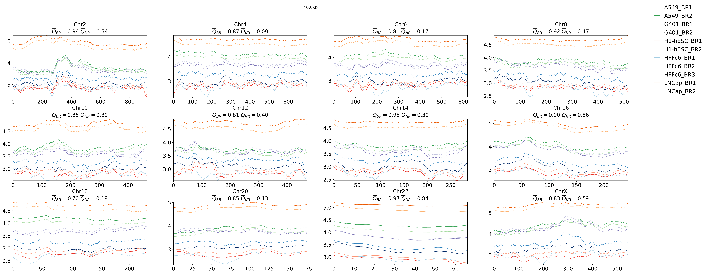

ENT3C is a method for qunatifying the similarity of micro-C/Hi-C derived chromosomal contact matrices. It is based on the von Neumann entropy<sup>1</sup> and recent work on entropy quantification of Pearson correlation matrices<sup>2</sup>.
For a contact matrix, ENT3C records the change in local pattern *complexity* of smaller Pearson-transformed submatrices along a matrix diagonal to generate a characteristic signal. Similarity is defined as the Pearson correlation between the respective entropy signals of two contact matrices.

https://github.com/X3N1A/ENT3C


## Installation

1) generate and activate python environment 
	
	```
	python3.11 -m venv .ent3c_venv

	source .ent3c_venv/bin/activate
	```

2) install ENT3C:

	```
	pip install ENT3C
	```

# Usage 


* CLI usage:

	```
	Usage:
    	ENT3C <command> --config=<path/to/config.json> [options]

    	Commands:
            get_entropy        Generates entropy output file <entropy_out_FN> .
            get_sim            Generates similarity output file <similarity_out_FN> from <entropy_out_FN>.
            run_all            Generates <entropy_out_FN> and <similarity_out_FN>.
            compare_groups     Compare signal groups (requires --group1 and --group2 options)

    	Global Options:
            --config=<path>    Path to config JSON file (required for all commands)

    	<compare_groups> Options:
        	--group1=<GROUP>        First group name, must correspond to what comes before _BR* in config file.
        	--group2=<GROUP>        Second group name, must correspond to what comes before _BR* in config file.

		Examples:
            ENT3C run_all --config=configs/myconfig.json
            ENT3C get_entropy --config=configs/myconfig.json
            ENT3C get_similarity --config=configs/myconfig.json
            ENT3C compare_groups --config=configs/myconfig.json --group1=H1-hESC --group2=K562
	```

* alternatively run ENT3C in python as:

	```
	import ENT3C

	ENT3C_OUT = ENT3C.run_get_entropy("config/myconfig.json")

	Similarity = ENT3C.run_get_similarity("config/myconfig.json")

	ENT3C_OUT, Similarity = ENT3C.run_all("config/myconfig.json")

	EUCLIDEAN = ENT3C.run_compare_groups("config/myconfig.json",group1,group2)

	```

* all ENT3C parameters are defined in .json files ```config/config.json```. Examples can be found in ```config``` directory.

* Paremeters defined in <config_file>: 

	1) The main ENT3C parameter affecting the final entropy signal $S$ is the dimension of the submatrices ```SUB_M_SIZE_FIX```. 

		* ```"SUB_M_SIZE_FIX": <integer>``` $\dots$ fixed submatrix dimension.

			* ```SUB_M_SIZE_FIX``` can be either be fixed by or alternatively, one can specify ```CHRSPLIT```; in this case ```SUB_M_SIZE_FIX``` will be computed internally to fit the number of desired times the contact matrix is to be paritioned into. 

			```PHI=1+floor((N-SUB_M_SIZE)./phi)```

			where ```N``` is the size of the input contact matrix, ```phi``` is the window shift, ```PHI``` is the number of evaluated submatrices (consequently the 	number of data points in $S$).

		* ```"CHRSPLIT": <integer>``` $\dots$ number of submatrices into which the contact matrix is partitioned into. If specified, then ``"SUB_M_SIZE_FIX": null`` otherwise ``"CHRSPLIT": null``. 

	2) ```"DATA_PATH": </path/to/data> ``` $\dots$ input data path. 

	3) input files in format: ```[<COOL_FILENAME>, <SHORT_NAME>]```
		``` 
		"FILES": [
			"ENCSR079VIJ.BioRep1.40kb.cool",
			"G401_BR1",
			"ENCSR079VIJ.BioRep2.40kb.cool",
			"G401_BR2"]
		``` 
		* Any biological replicates must be indicated in <SHORT_NAME> using the suffix "_BR%d".

		* **Note:** ENT3C also takes ```mcool``` files as input. 

	4) ```"`OUT_DIR": "<desired_output_directory_name>"``` $\dots$ output directory. ```OUT_DIR``` will be concatenated with ```OUTPUT/JULIA/``` or ```OUTPUT/MATLAB/```.

	5) ```"OUT_PREFIX": "<desired_output_prefix_>"``` $\dots$ prefix for output files.

	6) ```"Resolution": "<integer,integer,...>" e.g. "40e3,100e3"``` $\dots$ resolutions to be evaluated. 

	7) ```"ChrNr": "<integer,integer,...>" "15,16,17,18,19,20,21,22,X"``` $\dots$ chromosome numbers to be evaluated.

	8) ```"NormM": <0|1>``` $\dots$ input contact matrices can be balanced. If ```NormM: 1```, balancing weights in cooler are applied. If set to 1, ENT3C expects weights to be in dataset ```/resolutions/<resolution>/bins/<WEIGHTS_NAME>```.

	9) ```"WEIGHTS_NAME": "<name_of_weights>"``` $\dots$ name of dataset in cooler containing normalization weights.

	10) ```"phi": <integer>``` $\dots$ number of bins to the next matrix.

	11) ```"PHI_MAX": <integer>``` $\dots$ number of submatrices; i.e. number of data points in entropy signal $S$. If set, $\varphi$ is increased until $\Phi \approx \Phi\_{\max}$.


# Output files:

1) ```<OUT_DIR>/<OUTPUT_PREFIX>_ENT3C_similarity.csv``` $\dots$ will contain all combinations of comparisons. The second two columns contain the short names specified in ```FILES``` and the third column ```Q``` the corresponding similarity score.  
	```
	Resolution	ChrNr	Sample1	Sample2	Q
	40000	2	HFFc6_BR3	A549_BR2	0.6132789056404898
	40000	2	HFFc6_BR3	LNCap_BR2	0.3126805134567409
	40000	2	HFFc6_BR3	LNCap_BR1	0.4221187669214683
	40000	2	HFFc6_BR3	HFFc6_BR2	0.9632461160758761
	.		.	.		.	.	.		.		.		.		.
	.		.	.		.	.	.		.		.		.		.
	.		.	.		.	.	.		.		.		.		.
	```

2) ```<OUT_DIR>/<OUTPUT_PREFIX>_ENT3C_OUT.csv``` $\dots$ ENT3C output table. 

	```
	Name	ChrNr	Resolution	n	PHI	phi	binNrStart	binNrEND	START	END	S
	G401_BR1	2	40000	500	918	6	0	499	0	20000000	3.7896426915562462
	G401_BR1	2	40000	500	918	6	6	505	240000	20240000	3.789044181663418
	G401_BR1	2	40000	500	918	6	12	511	480000	20480000	3.7918253959272032
	.		.	.		.	.	.		.		.		.		.
	.		.	.		.	.	.		.		.		.		.
	.		.	.		.	.	.		.		.		.		.
	```

	Each row corresponds to an evaluated submatrix with fields ```Name``` (the short name specified in ```FILES```), ```ChrNr```, ```Resolution```, the sub-matrix dimension ```sub_m_dim```, ```PHI=1+floor((N-SUB_M_SIZE)./phi)```, ```binNrStart``` and ```binNrEnd``` correspond to the start and end bin of the submatrix, ```START``` and ```END``` are the corresponding genomic coordinates and ```S``` is the computed von Neumann entropy.


	- Example of output generated for ```ENT3C get_entropy --config=config/myconfig.json```:
		- ```EvenChromosomes_NoWeights_40kb_ENT3C_signals.pdf```
		- unbalanced 40kb contact matrices for even chromosomes across 5 cell lines. ```SUB_MATRIX_SIZE``` was 500:
<figure>
    
</figure>


3) ```<OUT_DIR>/<OUTPUT_PREFIX>_Eucl_<group1>vs<group2>.csv``` $\dots$ Euclidean distance between average z-scores of S over ```<group1>``` and ```<group2>```:
	(here group1=HFFc6, group2=G401)

	```
	Resolution	ChrNr	START	END	meanS_Euclidean
	40000	6	62360000	82360000	3.3625023926723685
	40000	6	62120000	82120000	3.3546076641065095
	40000	6	61880000	81880000	3.3441925121710026
	```

	- Example of first page of output generated for ```ENT3C compare_groups --config=config/myconfig.json --group1 = HFFc6 group2 = "G401"```
		- ```EvenChromosomes_NoWeights_Eucl_40kb_HFFc6vsG401.pdf```

<figure>
    
</figure>

